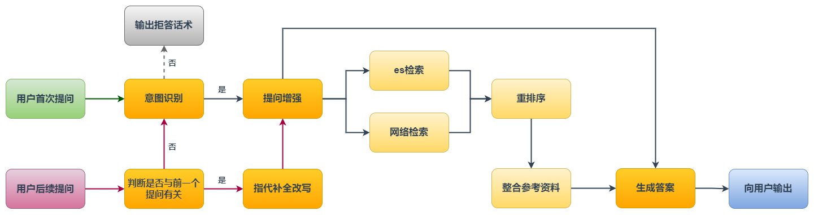

# 🤖LAW_zh_RAG： 从零开始搭建中文法律大模型助手

## 📌 项目简介

本项目基于 **LangChain** 和 **Elasticsearch** 数据库构建，实现了一套数据检索与推理的完整流程。主要功能包括：
- **数据存储与索引**：利用 **Elasticsearch** 进行高效文档存储与查询。

- **Embedding 向量检索**：结合本地 **SentenceTransformer** 模型，提高文本匹配精度。

- **重排序（Reranking）**：使用 **CrossEncoder** 模型优化搜索结果排序，提高结果相关性。

- **模型推理**：支持终端命令运行推理任务。

- **流程图**：

  流程图中的橙色节点代表调用API。运行模型后你可以在 `run.log` 中查看包含对话历史的相关日志。

---

## ⚙️ 1. 环境安装

#### 1️⃣ 创建 Python 3.10 环境

本项目基于 Python 3.10，推荐使用 Conda 进行环境管理：
```bash
conda create -n law_rag python=3.10 -y
conda activate law_rag
```

#### 2️⃣ 安装依赖

在创建好的 Conda 环境中，运行：

```bash
pip install -r requirements.txt
```

## 🔑2. 运行前的准备

#### 1️⃣ 配置 `.env` 文件

使用前，需要在 **项目根目录** 创建一个 `.env` 文件，并配置 API Keys，例如：

```.env
OPENAI_API_KEY=your_openai_api_key
QWEN_API_KEY=your_qwen_api_key
DEEPSEEK_API_KEY=your_deepseek_api_key
```

#### 2️⃣ 下载本地 Embedding & Rerank 模型

本项目使用 **SentenceTransformer** 进行文本向量化，以及 **CrossEncoder** 进行重排序。推荐使用 `bge-large-zh-v1.5` 与 `bge-reranker-v2-m3` 作为本地模型使用。

## 🛠️ 3. 配置个性化文件

在运行项目前，你需要 **个性化配置** 下面两个文件：

- `start_es.py`：修改 Elasticsearch 配置（密码、证书认证等）。
- `models.py`：调整本地模型路径，加载你希望使用的 API。

## 🚀 4. 项目使用流程

#### 1️⃣ 数据处理

在运行模型推理前，需要进行 **数据预处理**。执行：

```bash
python data_processing.py
```

该脚本会将原始文本数据转换为 向量格式写入 **JSON** 文件，通过 `bulk` 存入 **Elasticsearch** 中。

#### 2️⃣ 模型推理

推理阶段可以通过终端运行：

```bash
python run_script.py "用户名"
```

- `"用户名"` 为可选参数，主要用于上下文管理系统，可以不填直接运行：

```bash
python run_script.py
```

## 📝 5. 模型微调

模型微调使用的框架是 **LLaMA-Factory**，对 `Qwen2.5-0.5B-Instruct` 和 `Qwen2.5-7B-Instruct` 进行全参微调，使用 **vllm** 作为推理框架，并使用 **FastAPI** 部署模型。

`finetune`文件夹下包含数据处理脚本、最终训练数据以及训练参数脚本，请按需进行修改。

## 🎯6. EVAL

可以运行 `eval` 文件夹下的 `run_eval.py` 进行评估，当前支持的评估方式有

- 本地es检索的 **命中率** 与 **精确率**；
- **baseline**、**finetune **以及 **RAG** 的端到端精确率。

注意：由于 DuckDuckGo 的 API 限制，关于 **RAG** 的测试部分仅包含本地es检索，不含网络检索部分！

检索结果将以 `json` 和 `csv` 格式存储，可进行后续检查。

|                | 命中率 | 精确率 |
| :------------: | :----: | :----: |
| **rerank = 3** | 94.17% | 77.62% |
| **rerank = 4** | 98.67% | 71.57% |


| 基础模型/对照实验 | baseline | baseline+RAG | finetune | finetune+RAG |
| :---------------: | :------: | :----------: | :------: | :----------: |
| **Qwen2.5-0.5B**  |   0.05   |     0.1      |  *0.17*  |   **0.19**   |
|  **Qwen2.5-7B**   |   0.80   |   **0.83**   |   0.76   |    *0.81*    |


### 🎉 祝您使用顺利！
